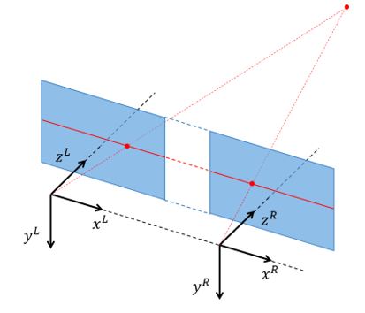

# Lab 7: Stereo calibration and processing
Welcome to lab 7!

In this lab we will calibrate a stereo camera and experiment with stereo processing.

Start by cloning this repository on your machine. 
Then open the lab project in CLion.

The lab is carried out by following these steps:

1. [Get an overview](lab-guide/1-get-an-overview.md).
2. [Stereo calibration](lab-guide/2-stereo-calibration.md).
3. [Sparse stereo processing](lab-guide/3-sparse-stereo-processing.md).
4. [Dense stereo processing](lab-guide/4-dense-stereo-processing.md).

At an appropriate time, [our proposed solution](https://github.com/tek5030/lab_07_solution) will be made available.

Please start the lab by going to the [first step](lab-guide/1-get-an-overview.md).
